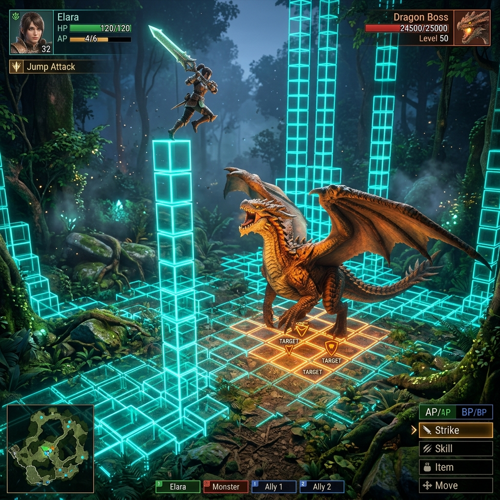
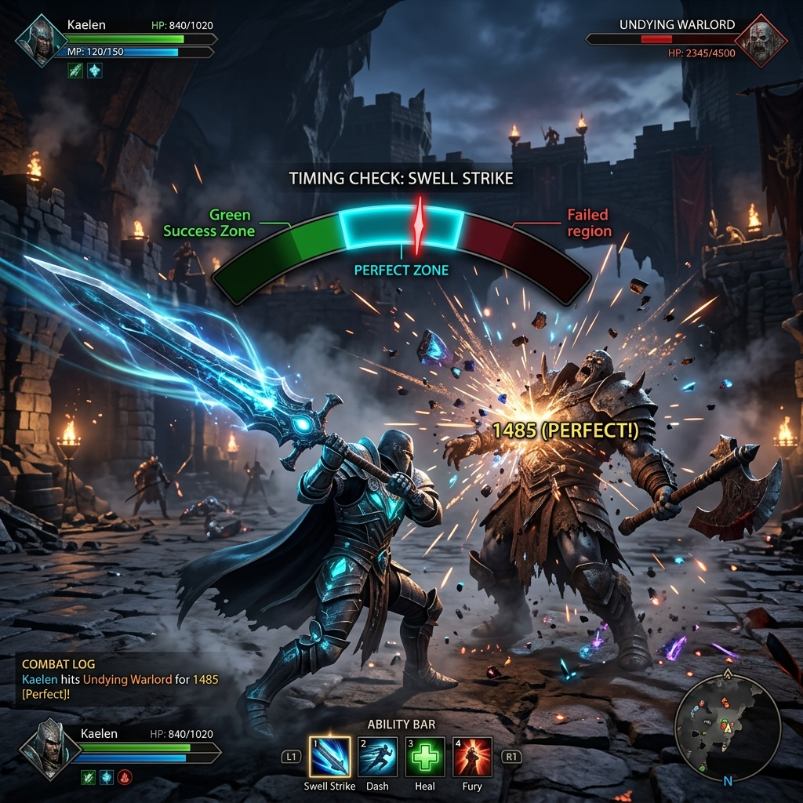
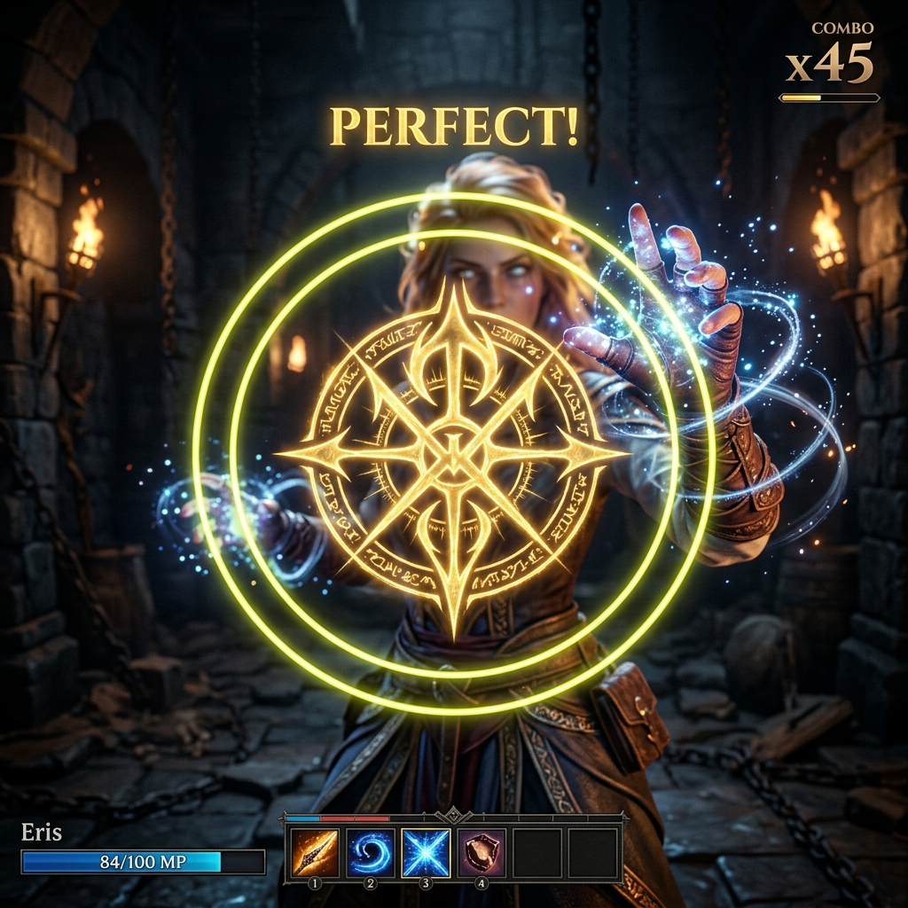

# Legends of Avantris: Battle Gameplay Visual Design Guide

This document details the visual style, aesthetics, and graphical specifications for the 3D voxel grid combat system, matching your vision of combining **Monster Hunter** level graphics with tactical **D&D 3D Voxel** grid overlays.

---

## 1. 3D Voxel Grid & Verticality
The battle world is divided into $5\text{ ft} \times 5\text{ ft} \times 5\text{ ft}$ cubes ($1.5\text{m} \times 1.5\text{m} \times 1.5\text{m}$ cell size) mapped dynamically over physical terrain, structures, and organic geometry:

*   **Voxel Styling**: Each grid cell is a semi-transparent, glassmorphic cube. It has thin glowing borders and a faint glowing texture on its bottom face.
*   **Vertical Height Nodes**: Grid cubes stretch upwards into the air and downwards into the soil.
    *   **Flight Cells (Y > 0)**: Glowing blue/cyan glass shader. Cells only activate and glow when a flying character ascends into them.
    *   **Ground Cells (Y = 0)**: Soft amber/orange tint indicating standard land speed bounds.
    *   **Burrowing Cells (Y < 0)**: Deep brown/purple subterranean glow showing underground travel pathways.
*   **Obstacles & Collision**: Obstacles (boulders, tree trunks, walls) are represented by deactivated, red-rimmed voxel grid blocks that block line-of-sight and movement.

---

## 2. Active Skill Timing UI Cues (Visual-Only Checks)
Timing checks are designed with a clean, minimal design with no clickable HUD buttons to ensure a high-action, visceral combat feel (similar to parrying in *Dark Souls*):

### Diegetic Over-Character Timing Bar (Precision Swing)
*   **Visual Position**: Instead of a static center-screen box, the timing bar floats dynamically in screen-space **directly above the active character's head**. This focuses all spatial attention onto the character's model during key strikes and defensive maneuvers.
*   **Infinite Bouncing with Speed Acceleration**: The timing slider indicator sweeps back and forth continuously. The player can wait as long as they want to lock in their input, but **with each bounce, the travel speed increases by +40%**, making it harder to target the zones.
*   **Time-Decay Rewards**:
    *   *Offensive Timing*: Succeeding immediately on the first sweep grants maximum bonus (up to $2.0\times$ critical damage).
    *   *Decay Penalty*: A decay multiplier reduces potential damage output by $25\%$ for every second spent waiting/hesitating (to a minimum floor of $30\%$ base power).
    *   *Defensive Block/Parry*: Mistiming defense or hesitating results in an **Off-Guard Impact** ($1.25\times$ damage taken and staggered).

---

## 3. Rhythm, Gesture, & Puzzle Active Check Modes
For spellcasters and martial abilities, we support diverse minigame interfaces representing distinct casting styles. To maintain complete graphical immersion, **no minigames pop up into a separate menu screen**. All checks are drawn as compact overlays floating directly $75\text{px}$ over the active character's head:

### Fighting Combo + Rhythm Spell Casting (Offensive Spells)
*   **Fighting Combo Inputs**: Activating a spell requires typing a fast key combo matching the spell (e.g. `S` -> `D` -> `F` for Fire Spells) within 2.0 seconds. Any wrong key causes an immediate spell fizzle (auto-fail).
*   **Multi-Beat Rhythmic Rings**: Succeeding in the combo launches a sequence of **3 rhythm beats in a row**. 
*   **Alternating Pulse Directions**: 
    *   *Beat 1*: Concentric yellow ring collapses from outside toward core boundary.
    *   *Beat 2*: Inner circle expands outward from core boundary.
    *   *Beat 3*: Concentric yellow ring collapses from outside.
*   **Rhythm Space Cues**: The player must tap `Space` as each beat aligns, accumulating spell power and saving throw DC levels.

### Mouse-Gesture Magic Circle Tracing (Rune Drawing)
*   **Checkpoint Tracing**: Triggers 3 glowing spatial nodes forming a triangular magic circle floating dynamically around the character's model in the 3D scene.
*   **Gameplay**: The player must free their mouse cursor and click checkpoints 1, 2, and 3 in exact numerical sequence within 2.0 seconds.
*   **Speed Scaling**: Completing the trace quickly grants a damage multiplier bonus (up to $+50\%$ damage). Clicks outside active checkpoints or out of order cause spell failures.

### Ranger/Rogue Osu Weak Spot Clicker (Osu Target)
*   **Precision Target spots**: Tailored specifically for Rangers preparing a Sniper shot or Rogues positioning a Sneak Attack.
*   **Gameplay**: 3 targets appear sequentially on the monster's model screen location representing critical weak spots (head, heart, leg).
*   **Approach Rings**: An outer approach ring shrinks toward the center core (shrinks from $2.0\times$ scale down to $0.5\times$ scale). The player must click the target exactly when the ring matches the inner core circle.
*   **Critical Boost**: Perfect click alignment generates critical hits with up to $+75\%$ sniper damage.

### Rune Symbol Recognition Puzzle (Utility/Blessing Spells)
*   For non-attacking utility/blessing spells (e.g. Blessing buff cast), players must solve a Rune Recognition challenge.
*   **Thematic Focus**: Prompts players to learn actual runic meanings (e.g. Fire = `ᚠ`, Ice = `ᛁ`, Shield/Defense = `ᚦ`, Life/Healing = `ᛒ`, Strength = `ᚢ`).
*   **Gameplay**: Displays a target prompt above the character's head (e.g. required runes: `"Life + Shield"` for Blessing).
*   **Selection interface**: A row of 5 clickable rune buttons is shown. The player must free their mouse and click the correct runes (`ᛒ` and `ᚦ`) within 4.0 seconds.
*   **Graduated Outcomes**:
    *   *All Correct*: Perfect (Full heal and blessing rolls boost).
    *   *Partially Correct* (e.g. 1 out of 2 when timer expires): Normal Success (Half spell power).
    *   *Incorrect or None*: Fail (Spells fizzles and backfires).

### Randomized Pattern Sequence Matcher (QE / QER keys)
*   **Fighter Taunt (2-Key Challenge)**: Instead of a timed timeline sweep, taunting now triggers a randomized typing challenge using keys `Q` (colored Red) and `E` (colored Cyan).
    *   *Gameplay*: Displays a randomized string of 8 characters (e.g. `QE E Q E Q Q E`) floating over the character's head. Hitting a correct key turns it Green, while typos reduce accuracy by $15\%$ per error. Hitting keys quickly increases success chance.
*   **Rune Spell Cast (3-Key Challenge)**: For rune-based magic attacks, a faster matching challenge using `Q` (Red), `E` (Cyan), and `R` (Yellow) triggers.
    *   *Gameplay*: Displays a randomized sequence of 10 keys (e.g. `QERREQ EQR E`). Hitting the sequence quickly (under 2.5 seconds) with high accuracy yields a critical spell damage bonus (up to $+75\%$ damage).

---

## 4. Grid Visibility Modes & Collateral Highlights
To manage visual complexity and enhance tactical choices:

### Cycle Grid Modes (All / Interaction-Only / None)
*   The player can press `G` or click the HUD cycle button to toggle between three visibility modes:
    1.  `All`: Renders all glowing tactical 3D voxel cells overlaying the landscape (useful for long-range planning).
    2.  `Interaction-Only`: Hides general grid cells, rendering only those cubes that the character is directly interacting with (standing on, moving into, or currently aiming/highlighting).
    3.  `None`: Shuts off all glowing grid overlays for maximum Monster Hunter visual immersion.

### Collateral Target Warnings (Flash Orangish-Red)
*   Entering **Aiming Mode** scans targeted voxel paths.
*   If other creatures, allies, or destructible objects (barricades, crates, explosive barrels) are caught in the spell blast radius or melee swing path, they are highlighted in the world and HUD list as **Collateral Danger Warnings**.
*   These warning cells flash in **light orangish-red** to prompt the player to adjust aiming or confirm risk of collateral impact before executing the QTE.
