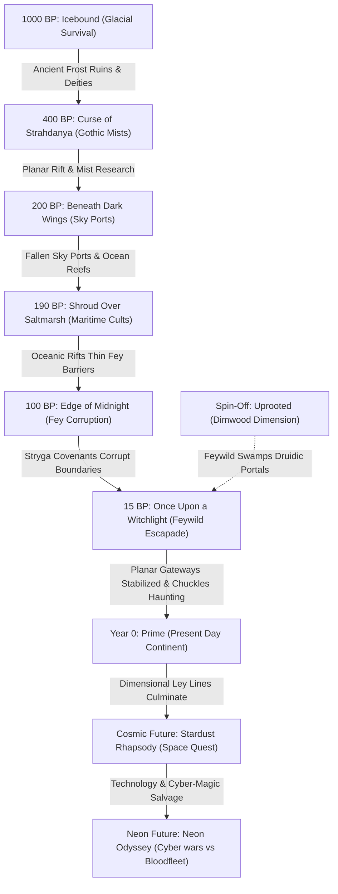

# Legends of Avantris: Ultimate Campaign & Episode Encyclopedia

Welcome to the ultimate guide to the homebrew D&D worlds of **Legends of Avantris**. This encyclopedia provides a detailed breakdown of all 10 campaigns, their player characters, narrative arcs, chronological connections, and episode logs.

---

## 1. Chronological Timeline & Planar Connections

Most mainline campaigns take place within the same interconnected universe of **Avantris**. Chronology is tracked relative to the campaign ***Prime***, which is designated as **Year 0** (present day). Eras before it are marked as **BP** (Before Prime). 

---

## 2. Comprehensive Campaign Directory

### Campaign 1: Icebound (1000 BP)
*   **Setting:** Drakkar, a brutal, frozen arctic wasteland.
*   **System Rules:** Hardcore survival mechanics (rations, water, spell components, and extreme cold exposure are strictly tracked).
*   **Dungeon Master (DM):** Andy Flynn / Mikey Gilder (Co-developed).
*   **Main Party (Player Characters):**
    *   **Barnabos the Dreadwake** (Mikey) - Triton Barbarian (Path of the Beast). A powerful aquatic warrior adapted to subzero ice.
    *   **Taishen Fireblossom** (Mace) - Dragonborn Sorcerer. Uses fire magic to ward off freezing.
    *   **Queenie March** (Nikkie) - Rabbitfolk Ranger. Expert scout and hunter.
    *   **Jornir** (Richie) - Firbolg Druid. Connected to ancient frost forest spirits.
    *   **Skrimm Stabbaskotch** (Andy) - Goblin Warlock. Driven by whispers from an icy patron.
*   **Major Storyline Arcs:**
    *   *Arc 1: The Southward Gambit (Ep. 1-12)*: The party is shipwrecked off the coast of Drakkar and must establish a camp.
    *   *Arc 2: The Frost Wastes (Ep. 13-25)*: Exploring ancient frost dungeons and dodging wandering ice giants.
    *   *Arc 3: Hollowed Out (Ep. 26-38)*: Discovering an eldritch cult trying to wake a frozen leviathan under the glaciers.
    *   *Arc 4: Blood and Ice (Ep. 39-45)*: The final stand against the cult in the heart of the glacial vortex.
*   **Chronological Episode Highlights:**
    | Episode | Title | Key Narrative Events | Notable Loot / Legacy |
    | :--- | :--- | :--- | :--- |
    | Ep. 1 | The Southward Gambit | The wreck of the *More Abound*; establishing basic shelter. | Flint axes, frozen fish. |
    | Ep. 12 | Make No Fire | The party is trapped in a magical blizzard and must make difficult survival checks. | Frost giant boots. |
    | Ep. 26 | Hollowed Out | Uncovering the first signs of the frozen leviathan's influence. | Icy runestone. |
    | Ep. 45 | The Eternal Frost | The leviathan is sealed back beneath the ice; survivors set off south. | Seal of the Dreadwake. |

---

### Campaign 2: Curse of Strahdanya (400 BP)
*   **Setting:** The mist-shrouded valley of Barovia (planar dread domain).
*   **System Rules:** Gothic horror themes, sanity metrics, gender-swapped adaptation.
*   **Dungeon Master (DM):** Mikey Gilder.
*   **Main Party (Player Characters):**
    *   **Professor Clayton Azran** (Mikey) - Human Wizard (School of Divination). Diviner obsessed with mapping dimensional portals.
    *   **Victoria Isaacs** (Nikkie) - Half-Elf Sorcerer (Shadow Magic). Tied to the dark entities of the mists.
    *   **Kana Soyokaze** (Kelsey) - Human Fighter. Guardian of the Azran expedition.
*   **Major Storyline Arcs:**
    *   *Arc 1: The Doomed Expedition (Ep. 1-10)*: Entering the mists and exploring the nightmare Death House.
    *   *Arc 2: Phantasmagoria (Ep. 11-28)*: Surviving Countess Strahdanya's psychological mind games in Castle Ravenloft.
    *   *Arc 3: Blood Moon (Ep. 29-45)*: Recruiting allies in Barovia and executing the assault on Castle Ravenloft.
*   **Chronological Episode Highlights:**
    | Episode | Title | Key Narrative Events | Notable Loot / Legacy |
    | :--- | :--- | :--- | :--- |
    | Ep. 1 | Death House | The party investigates a haunted manor on the edge of the Barovian woods. | Clayton's Spellbook. |
    | Ep. 15 | Phantasmagoria | Clayton receives a vision from the Divination deck showing Strahdanya's past. | The Tome of Strahdanya. |
    | Ep. 30 | Suffer the Little Children | Confronting the swamp witches and rescuing children. | Sunsword replica. |
    | Ep. 45 | Blood Moon | The final duel in Castle Ravenloft; Countess Strahdanya is sealed in her coffin. | Azran Portal Coordinates. |

---

### Campaign 3: Beneath Dark Wings (200 BP)
*   **Setting:** The skies of Avantris, featuring airships and floating island kingdoms.
*   **System Rules:** Airship combat, flying maneuvers, sky-faring exploration.
*   **Dungeon Master (DM):** Richie Gilder.
*   **Main Party (Player Characters):**
    *   **Toa Kamanui** (Richie) - Goliath Barbarian (Ancestral Guardian). Heavy weapons expert.
    *   **Iris of the Sands** (Nikkie) - Tabaxi Cleric. Navigator and healer.
    *   **Felix Ackerman** (Andy) - Human Wizard. Scholar of flying runes.
    *   **Lufti** (Kelsey) - Air Genasi Monk. Acrobat of the rigging.
*   **Major Storyline Arcs:**
    *   *Arc 1: Sky Pirates of Stryga (Ep. 1-12)*: Assembling the airship crew and fighting imperial fleet blockades.
    *   *Arc 2: The Aether Reef (Ep. 13-25)*: Navigating magical floating reefs filled with sky-krill and stormy anomalies.
    *   *Arc 3: Wings of Stryga (Ep. 26-35)*: Laying siege to the floating fortress of the Sky Emperor.
*   **Chronological Episode Highlights:**
    | Episode | Title | Key Narrative Events | Notable Loot / Legacy |
    | :--- | :--- | :--- | :--- |
    | Ep. 1 | Skyborn | The crew steals an imperial airship, *The Silver Kestrel*. | Compass of the Winds. |
    | Ep. 14 | The Aether Storm | Hovering inside a tempest; Lufti executes an epic leap between ships. | Feather Fall ring. |
    | Ep. 35 | Crimson Sails | The Sky Emperor's fleet is destroyed; skyports collapse into the sea. | Airship Core shards. |

---

### Campaign 4: Shroud Over Saltmarsh (190 BP)
*   **Setting:** The coastal ports, reefs, and open waters around Saltmarsh.
*   **System Rules:** D&D 5e nautical rules, ship upgrade logs, crew morale mechanics.
*   **Dungeon Master (DM):** Mace Caffrey.
*   **Main Party (Player Characters):**
    *   **Paladin Poros of Malthea** (Richie) - Aasimar Paladin (Oath of Glory). Radiant crusader.
    *   **Monty Crumb** (Andy) - Human Rogue. Ship's cook and spy.
    *   **Kaiyo Pearlfin** (Kelsey) - Triton Druid. Protector of the reefs.
*   **Major Storyline Arcs:**
    *   *Arc 1: The Azure Maiden (Ep. 1-8)*: The party cleans out a smuggler cave and claims their ship.
    *   *Arc 2: Deep Sea Cults (Ep. 9-18)*: Exploring shipwrecks created by the skyports' collapse 10 years prior.
    *   *Arc 3: Port of Despair (Ep. 19-25)*: Defending Saltmarsh from an armada of sea-devils.
*   **Chronological Episode Highlights:**
    | Episode | Title | Key Narrative Events | Notable Loot / Legacy |
    | :--- | :--- | :--- | :--- |
    | Ep. 1 | Smuggler's Run | Uncovering contraband in the caverns underneath the Saltmarsh cliffs. | Smuggler ledger. |
    | Ep. 10 | Sunken Reefs | Exploring the ruins of a floating skyport that crashed into the sea. | Core of the Kestrel. |
    | Ep. 25 | Oceanic Vortex | Defeating the high priest of the sea cult, sealing the portal. | Trident of Ocean Command. |

---

### Campaign 5: Edge of Midnight (100 BP)
*   **Setting:** Druskenvald, a dark Victorian steam-fantasy land of eternal night.
*   **System Rules:** Folk horror, corruption mechanics, firearms rules.
*   **Dungeon Master (DM):** Andy Flynn.
*   **Main Party (Player Characters):**
    *   **Lethica Nightborne** (Derek) - Twilight Elf Cleric. Devoted investigator of Stryga.
    *   **Jericho Sticks** (Mikey) - Scarecrow Bard (College of Whispers). Relic of the cornfields.
    *   **Briggsy Kratch** (Richie) - Jinxcursed Warlock. Deals with the shadows.
*   **Major Storyline Arcs:**
    *   *Arc 1: Shadows of Druskenvald (Ep. 1-12)*: Investigating steam-mill murders and encountering werewolves.
    *   *Arc 2: Stryga's Covenant (Ep. 13-24)*: Uncovering a pact between the city council and a dark forest entity.
    *   *Arc 3: The Clockwork Eclipse (Ep. 25-35)*: Halting a ritual designed to make the eternal night permanent.
*   **Chronological Episode Highlights:**
    | Episode | Title | Key Narrative Events | Notable Loot / Legacy |
    | :--- | :--- | :--- | :--- |
    | Ep. 1 | Mill Street Murders | Finding straw dolls left at the murder scenes; Jericho joins the party. | Scarecrow needle. |
    | Ep. 18 | The Wolf's Den | Infiltrating a covenant of werewolves hiding in the industrial district. | Silver pocketwatch. |
    | Ep. 35 | Broken Gears | Stopping the eclipse tower; the dark magic weakens fey boundaries. | Stryga's Seed. |

---

### Campaign 6: Once Upon a Witchlight (15 BP)
*   **Setting:** The whimsical, fey-touched swamps and palaces of Prismeer.
*   **System Rules:** Feywild pacts, whimsy tracker, wild magic surge logs.
*   **Dungeon Master (DM):** Andy Flynn.
*   **Main Party (Player Characters):**
    *   **Kremy Lecroux** (Richie) - Crocodilefolk Warlock. Ringleader.
    *   **Gideon Coal** (Mace) - Fire Genasi Fighter. Muscle.
    *   **Gricko Grimgrin** (Mikey) - Goblin Druid. Illiterate forest child.
    *   **Morning Frost** (Derek) - Tiger Tabaxi Sorcerer. Flamboyant caster.
*   **Major Storyline Arcs:**
    *   *Arc 1: Carnivàle Lecroux (Ep. 1-15)*: Setting up magic scams and fleeing the Baron's guards.
    *   *Arc 2: Hither Swamps (Ep. 16-35)*: Dealing with Bavlorna Blightstraw and dodging Chuckles' spirit.
    *   *Arc 3: Palace of Heart's Desire (Ep. 36-70)*: Confronting the Hourglass Coven and restoring fey rule.
*   **Chronological Episode Highlights:**
    | Episode | Title | Key Narrative Events | Notable Loot / Legacy |
    | :--- | :--- | :--- | :--- |
    | Ep. 1 | The Southward Scam | Kremy sells false youth potions; Gideon punches a clown. | Gideon's heavy chains. |
    | Ep. 6 | Guys' Night | The party gets drunk at a tavern and accidentally summons a fey beast. | Ring of Charisma. |
    | Ep. 16 | Monarch for a Day | Gricko is crowned king of the swamp frogs, leading to utter chaos. | Frog crown. |
    | Ep. 42 | All Dolled Up | The party is shrunk and forced to navigate a creepy dollhouse. | Tiny silver needle. |

---

### Campaign 7: Prime (Year 0 - Present Day)
*   **Setting:** The main continent of Avantris, featuring medieval high fantasy kingdoms.
*   **System Rules:** Classic D&D 5e high fantasy, global reputation metrics.
*   **Dungeon Master (DM):** Mikey Gilder.
*   **Main Party (Player Characters):**
    *   **Rodek Stonehearth** (Richie) - Dwarf Cleric. Forge master.
    *   **Vandrys Truestrike** (Andy) - Elf Rogue. Archer and scout.
    *   **Anulin** (Kelsey) - Elf Wizard. Planar researcher.
    *   **Sylvie** (Nikkie) - Halfling Druid. Healer.
*   **Major Storyline Arcs:**
    *   *Arc 1: The Stonehearth Saga (Ep. 1-30)*: The party uncovers a dragon cult in the dwarven kingdoms.
    *   *Arc 2: Planar Fracture (Ep. 31-65)*: Global portals open, bringing in historic threats from 1000 BP.
    *   *Arc 3: The Prime Alliance (Ep. 66-91)*: Uniting the kingdoms to seal the ley lines of Avantris.
*   **Chronological Episode Highlights:**
    | Episode | Title | Key Narrative Events | Notable Loot / Legacy |
    | :--- | :--- | :--- | :--- |
    | Chapter 1 | Stone and Steel | The party defends a caravan from goblin raiders near the forge. | Forge Hammer of Stonehearth. |
    | Chapter 32 | Anthem | A dimensional rift brings the ghost ship Azure Maiden into the harbor. | Sailor logs. |
    | Chapter 35 | Going Down the Bayou | The party traverses a swamp that has warped into Prismeer. | Frog relics. |
    | Chapter 91 | The Prime Seal | The portals are sealed, but arcane radiation leaks into space. | Stardust coordinates. |

---

### Campaign 8: Uprooted (Spin-Off Dimension)
*   **Setting:** The Dimwood, a woodland plane populated by animal factions.
*   **System Rules:** Woodland politics, faction warfare, animal abilities.
*   **Dungeon Master (DM):** Mikey Gilder.
*   **Main Party (Player Characters):**
    *   **Bitsy** (Derek) - Field Mouse Rogue. Needle-bladed stealth specialist.
    *   **Grumley** (Richie) - Badger Barbarian. Stew-cooking powerhouse.
    *   **Hazel** (Kelsey) - Squirrel Druid. Archer.
*   **Major Storyline Arcs:**
    *   *Arc 1: Cat and Mouse (Ep. 1-7)*: Navigating the war between the feral cats and woodland critters.
    *   *Arc 2: Jailhouse Rooster (Ep. 8-14)*: Executing a prison break to rescue a key spy.
*   **Chronological Episode Highlights:**
    | Episode | Title | Key Narrative Events | Notable Loot / Legacy |
    | :--- | :--- | :--- | :--- |
    | Ep. 1 | Cat and Mouse | Bitsy slips into a cat outpost to steal political maps. | Woodland map. |
    | Ep. 5 | Crazy River | Crossing a rushing river on a fragile twig raft under fire. | Grumley's iron frying pan. |
    | Ep. 14 | Plague Reigns | The party defeats the mad scientist rat, saving the forest. | Faction alliance seal. |

---

### Campaign 9: Stardust Rhapsody (Cosmic Future)
*   **Setting:** Outer space, featuring cosmic empires and starships.
*   **System Rules:** Spelljammer/Starfinder mechanics, laser combat, space navigation.
*   **Dungeon Master (DM):** Richie Gilder.
*   **Main Party (Player Characters):**
    *   **Captain Pyke** (Richie) - Bounty hunter.
    *   **Rett** (Andy) - Pilot.
    *   **Chuckles (Space Jester)** (Mikey) - Rogue. Galactic menace.
*   **Major Storyline Arcs:**
    *   *Arc 1: Stardust Overture (Ep. 1-15)*: Gathering the crew and taking on bounty hunting contracts.
    *   *Arc 2: Stardust Anthem (Ep. 16-50)*: Fighting the corporate space guilds for control of portals.
*   **Chronological Episode Highlights:**
    | Episode | Title | Key Narrative Events | Notable Loot / Legacy |
    | :--- | :--- | :--- | :--- |
    | Ep. 1 | Overture | The crew of *The Rhapsody* takes a bounty on a space goblin. | Plasma pistols. |
    | Ep. 20 | The Comet Chase | Pursuing a comet containing frozen primordial magical cores. | Glacial core. |
    | Ep. 50 | Cosmic Gateway | Sealing the central space rift; establishing the cyber age. | Star Map. |

---

### Campaign 10: Neon Odyssey (Neon Future)
*   **Setting:** High-tech spaceports and cybernetic megacities.
*   **System Rules:** Cyberpunk fantasy rules, hacking matrices, laser combat.
*   **Dungeon Master (DM):** Mikey Gilder.
*   **Main Party (Player Characters):**
    *   **Vigilante Neon** (Derek) - Cyborg Rogue. Cyber-infiltrator.
    *   **Bloodfleet defector** (Richie) - Fighter. Heavy weapons specialist.
*   **Major Storyline Arcs:**
    *   *Arc 1: Megacity 9 (Ep. 1-12)*: Infiltrating corporation high-rises to retrieve research data.
    *   *Arc 2: Bloodfleet War (Ep. 13-30)*: Leading the resistance in deep space against the Bloodfleet corporate navy.
*   **Chronological Episode Highlights:**
    | Episode | Title | Key Narrative Events | Notable Loot / Legacy |
    | :--- | :--- | :--- | :--- |
    | Ep. 1 | System Hack | Hacking the database of the corporate sector; escaping drones. | Cyber-deck. |
    | Ep. 15 | Nebula Strike | Disabling a Bloodfleet flagship capital cruiser using a stealth pod. | Cyber-blade. |
    | Ep. 30 | Neon Horizon | Defeating the corporate AI; restoring digital freedom. | Neon Core. |

---

## 3. Timeline Connections & Legacies
Here is how the history of the universe flows from one campaign into the next:

1.  **Glacial Anchors (1000 BP):** The ancient ice runes and frost seals placed in *Icebound* act as the bedrock for the planet's tectonic magical balance.
2.  **Planar Thinning (400 BP):** The divination portal experiments conducted during *Curse of Strahdanya* weaken the dimensional membrane between the Material Plane and the Shadowfell/Feywild.
3.  **Debris from the Clouds (200 BP):** The aerial wars of *Beneath Dark Wings* result in the destruction of floating cities. Their magical mechanical hulls crash into the oceans, forming the dangerous sunken ruins explored 10 years later in *Shroud Over Saltmarsh*.
4.  **Coastal Bleed (190 BP):** Cults in *Saltmarsh* tap into these fallen skyport cores, creating portals that thin the boundary between the ocean and the Feywild water realms.
5.  **Forest Shadow (100 BP):** The gothic corruption of Stryga in *Edge of Midnight* travels through the continental root systems, warping the forests and allowing fey wild magic to break out, forming the Witchlight Carnival.
6.  **The Feywild Restored (15 BP):** The *Witchlight* crew's victory over the Hourglass Coven stabilizes the fey dimensions, preventing a catastrophic planar collapse just before the present era.
7.  **The Convergence (Year 0):** The *Prime* era represents the peak of continental civilization where history merges. Ancient frost dungeons, airship ruins, and planar theories from the past all play active roles.
8.  **Cosmic Departure (Future):** The radiation leaking from the Year 0 seals forms the stardust lanes, allowing descendants of the heroes to escape into deep space, establishing the *Stardust Rhapsody* and *Neon Odyssey* sagas.
